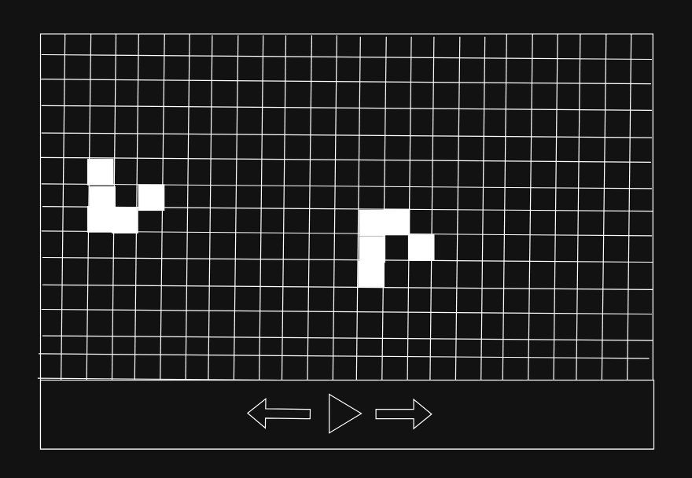

# Vaatimusmäärittely

## Sovelluksen tarkoitus

Sovelluksen tarkoitus on simuloida [John Conwayn Game of Life -soluautomaattia](https://fi.wikipedia.org/wiki/Game_of_Life), jossa käyttäjä voi piirtää automaatin ja simuloida sen toimintaa.

## Käyttöliittymäluonnos

Sovelluksen oletusnäkymässä on ruudukko, jossa näkyy simulaation tämänhetkinen tila. Alareunassa on 3 nappia, joilla voi ohjata simulaatiota. Tarkempi toiminta on kuvattu alempana.

## Perusversion toiminta

- Ruudukossa on oletusarvoisesti vain yksi "Glider" kun käyttäjä käynnistää sovelluksen. Tämä siksi, että jos käyttäjä ei tunne simulaatiota ollenkaan, hän saa edes jonkinlaisen idean siitä, mitä siinä tapahtuu. Täysin tyhjä ruudukko voisi olla epäselvä.

  - Glider (Wikipedia):

    

- Hiiren vasenta näppäintä painamalla käyttäjä voi kääntää solun tilan. Tämän tulisi keskeyttää simulaatio, jos se ei vielä ollut taukotilassa.
- Alareunan keskimmäistä nappia painamalla käyttäjä voi laittaa simulaation ajamaan itseään automaattisesti, tai tauottaa sen. Simulaation tulisi oletusarvoisesti päivittyä X kertaa sekunnissa (sopiva luku selviää kehityksen aikana).
- Alareunan oikeanpuolimmaista nappia painamalla simulaatio keskeytyy ja siirtyy seuraavaan tilaan.
- Ruudukko on rajattu X\*Y kokoon, sopiva koko selviää kehityksen aikana.

## Jatkokehitysideoita

- Pidä kirjaa simulaation tilan historiasta, jotta voidaan lisätä nappi millä pääsee edelliseen tilaan.
- Anna käyttäjän muuttaa simulaationopeutta
- Lisää paneeli oikeaan reunaan jossa on [valmiiksi rakennettuja olioita](https://en.wikipedia.org/wiki/Conway%27s_Game_of_Life#Examples_of_patterns), joita käyttäjä voi raahata ruudukkoon.
- Muuta ruudukko rajattomaksi, ja anna käyttäjän liikkua ja zoomata sitä
