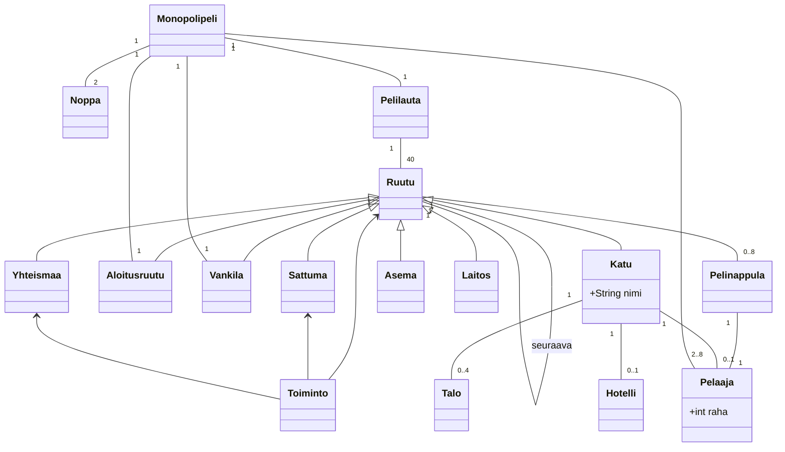

## Monopoli

```mermaid
 classDiagram
    Monopolipeli "1" -- "2" Noppa
    Monopolipeli "1" -- "1" Pelilauta
    Pelilauta "1" -- "40" Ruutu
    Ruutu "1" -- "1" Ruutu : seuraava
    Ruutu "1" -- "0..8" Pelinappula
    Pelinappula "1" -- "1" Pelaaja
    Pelaaja "2..8" -- "1" Monopolipeli

    %% Ruutuja on useampaa eri tyyppiä:
    Ruutu <|-- Aloitusruutu
    Ruutu <|-- Vankila
    Ruutu <|-- Sattuma
    Ruutu <|-- Yhteismaa
    Ruutu <|-- Asema
    Ruutu <|-- Laitos
    Ruutu <|-- Katu
    Katu : +String nimi

    %% Monopolipelin täytyy tuntea sekä aloitusruudun että vankilan sijainti.
    Monopolipeli "1" -- "1" Aloitusruutu
    Monopolipeli "1" -- "1" Vankila

    %% Jokaiseen ruutuun liittyy jokin toiminto.
    Ruutu <-- Toiminto

    %% Sattuma- ja yhteismaaruutuihin liittyy kortteja, joihin kuhunkin liittyy joku toiminto.
    Sattuma <-- Toiminto
    Yhteismaa <-- Toiminto

    %% Normaaleille kaduille voi rakentaa korkeintaan 4 taloa tai yhden hotellin
    Katu "1" -- "0..4" Talo
    Katu "1" -- "0..1" Hotelli

    %% Kadun voi omistaa joku pelaajista
    Katu "1" -- "0..1" Pelaaja

    %% Pelaajilla on rahaa
    Pelaaja : +int raha

```
