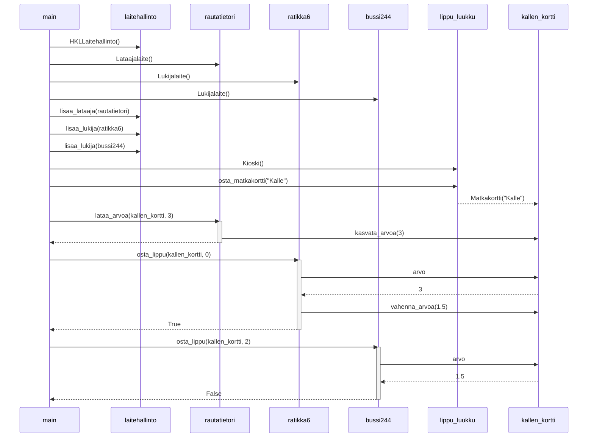

# Sekvenssikaavio

```mermaid
sequenceDiagram
    participant main

    participant laitehallinto
    main->>laitehallinto: HKLLaitehallinto()

    participant rautatietori
    main->>rautatietori: Lataajalaite()

    participant ratikka6
    main->>ratikka6: Lukijalaite()

    participant bussi244
    main->>bussi244: Lukijalaite()

    %% laitehallinto.lisaa_lataaja(rautatietori)
    main->>laitehallinto: lisaa_lataaja(rautatietori)

    %% laitehallinto.lisaa_lukija(ratikka6)
    main->>laitehallinto: lisaa_lukija(ratikka6)

    %% laitehallinto.lisaa_lukija(bussi244)
    main->>laitehallinto: lisaa_lukija(bussi244)

    participant lippu_luukku
    main->>lippu_luukku: Kioski()

    %% kallen_kortti = lippu_luukku.osta_matkakortti("Kalle")
    participant kallen_kortti
    main->>lippu_luukku: osta_matkakortti("Kalle")
    lippu_luukku-->>kallen_kortti: Matkakortti("Kalle")

    %% rautatietori.lataa_arvoa(kallen_kortti, 3)
    main->>rautatietori: lataa_arvoa(kallen_kortti, 3)
    activate rautatietori
    rautatietori->>kallen_kortti: kasvata_arvoa(3)
    rautatietori-->>main:
    deactivate rautatietori

    %% ratikka6.osta_lippu(kallen_kortti, 0)
    main->>ratikka6: osta_lippu(kallen_kortti, 0)
    activate ratikka6
    ratikka6->>kallen_kortti: arvo
    kallen_kortti-->>ratikka6: 3
    ratikka6->>kallen_kortti: vahenna_arvoa(1.5)
    ratikka6-->>main: True
    deactivate ratikka6

    %% bussi244.osta_lippu(kallen_kortti, 2)
    main->>bussi244: osta_lippu(kallen_kortti, 2)
    activate bussi244
    bussi244->>kallen_kortti: arvo
    kallen_kortti-->>bussi244: 1.5
    bussi244-->>main: False
    deactivate bussi244
```
